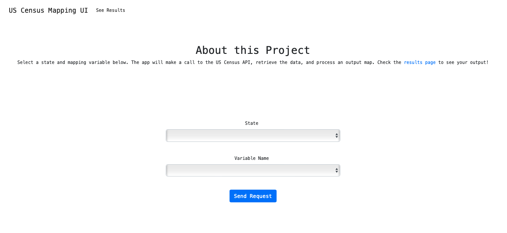
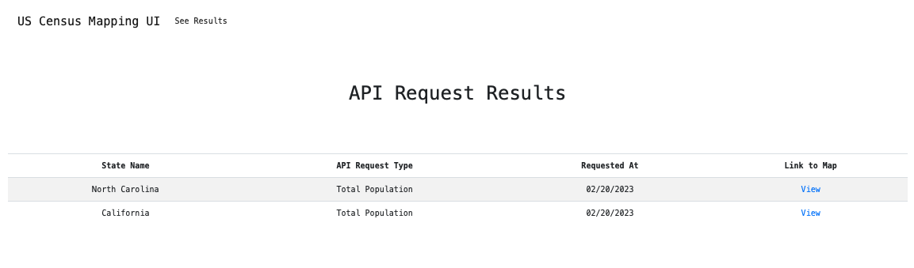
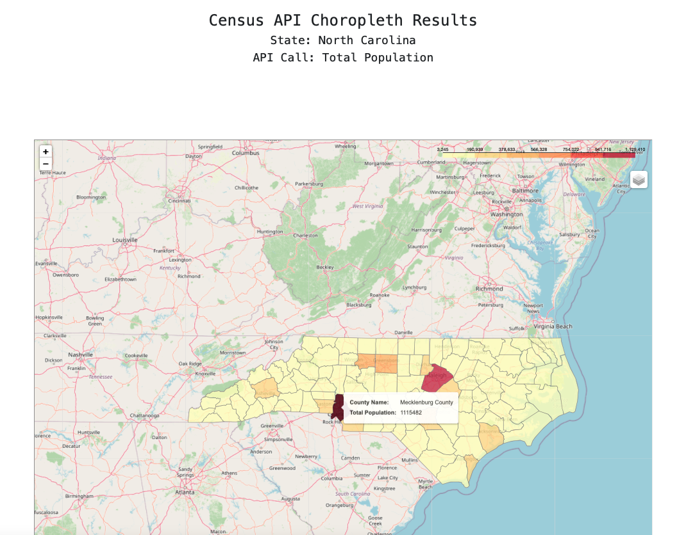

# US Census API Application

This is a lightweight `Flask` applicaiton that queries the US Census API, cleans the data, and renders an interactive `Folium` map with the output.

### Running the App

* This app is Dockerized and can be run simply with `docker compose up --build`
* The `Flask` app, `Redis` server, and `RQ` worker run in the same container
* Mapping requests are handled asynchronously so that users don't experience long wait times in the browser

### Usage Notes

* Select your state and API request type on the landing page

* A choropleth map is rendered and saved asynchronously; see all requests stored on the results page

* You can click on the `View` anchor for each request to see a customized rendering of the map

### Sticking Points

* This app can be *much* more abstract ... in its current form it would be hard to incorporate more Census API request types easily
  
* Standardizing the API responses was a bit laborious, as different years have different variable names that must be standardized before computation

* This project required me to research the data types that do (and don't!) work well with the `Folium` library ... this required extra standardizing and a bit of trial and error